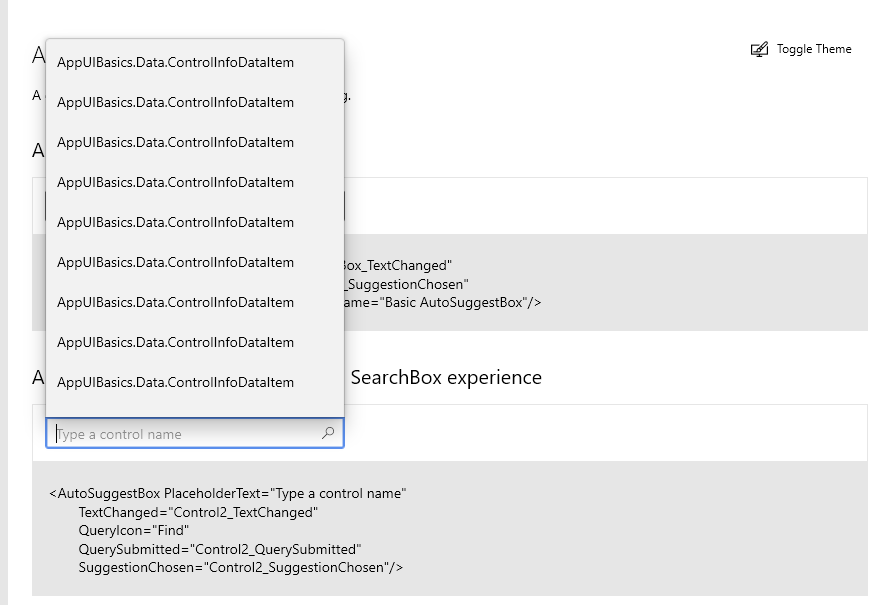
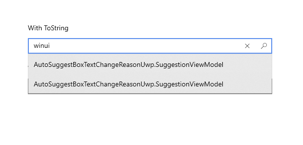
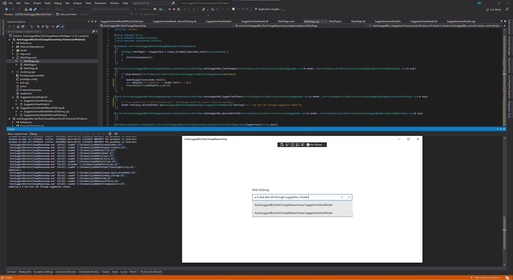

**Describe the bug**

`AutoSuggestBox`'s suggestion collection binding and text updating routines do not work well with collection item whose type is not string. `AutoSuggestBox` has some undocumented usage of `ToString` and some behavior related to these usage is inconsistent between C# and C++. On top of that, `TextChanged` would incorrectly report any change to `AutoSuggestBox.Text` in `SuggestionChosen` as `AutoSuggestionBoxTextChangeReason::UserInput` if the `ItemsSource`'s item type is not a string, regardless of whether the type implements `IStringable`, and regardless of whether the language is C# or C++.

**Hideen Usage of ToString**

There are two hidden usage of `ToString`:
1. Binding item to text in suggestion list
2. Setting `AutoSuggestBox.Text` inside `SuggestionChosen`

For (1), I could only confirm it when directly looking at the source of xaml control gallery. `AutoSuggestBoxPage.xaml` in the gallery (both uwp and WinUI3) contains no item template and I was wondering how the suggestion list binds `ControlInfoDataItem`. It turns out `ControlInfoDataItem` implements `ToString`. If I comment out said implementation of `ToString`, the suggestion lists would show the fully qualified name of `ControlInfoDataItem`, as shown below:

The [doc](https://docs.microsoft.com/en-us/uwp/api/Windows.UI.Xaml.Controls.AutoSuggestBox?view=winrt-19041#text-changed) only mentions:

> To control how items are displayed in the suggestion list, you can use DisplayMemberPath or ItemTemplate.

> To display the text of a single property of your data item, set the DisplayMemberPath property to choose which property from your object to display in the suggestion list.
To define a custom look for each item in the list, use the ItemTemplate property .

For (2), you can refer to the reproducing steps below. In short, setting a break point in the `ToString` method of the item of the collection bound to the `ItemsSource` of `AutoSuggestBox`, and calling `AutoSuggestBox.Text` inside `SuggestionChosen` handler would trigger the break point.

**Bugs**

There are two bugs, assuming the hidden usage of `ToString` is intended behavior (I appreciate the automatic conversion, but think more documention would help :)):
1. Even if `ToString` is implemented for the item of the collection bound to `AutoSuggestBox.ItemsSource`, suggestion list still shows the fully qualified type name, *in C++*. This bug does *not* happen in C#.
2. If `ToString` is implemented for the item of the collection bound to `AutoSuggestBox.ItemsSource`, `TextChanged` would report the reason as `UserInput` if in `SuggestionChosen` handler, `AutoSuggestBox.Text` is assigned a value that is not equal to `chosenItem.ToString()`; if `ToString` is not implemented for the item, `TextChanged` would report the reason as `UserInput` if `AutoSuggestBox.Text` is assigned any value.

For C++, unless otherwise specified, "implementing `ToString`" implies implementing the `IStringable` interface.

**Steps to reproduce bug (1)**

1. Clone the minimal reproducible https://github.com/roxk/auto-suggestbox-change-reason-min-repro. Launch either UWP or WinUI app.
2. Enter text in auto suggest box below the title `With ToString`
3. Observe the list shows fully qualified name of the underlying view model instead of the result of `ToString`

**Expected behavior**

The list shows the value of `ToString()` of the item instead of the fully qualified name of the item type.

**Actual behavior**

The list shows fully qualified name of the underlying item type. The fact that it works in C# is evident in the officla xaml control gallery.

**Screenshots**

**Steps to reproduce bug (2.1)**
#### With ToString
1. Clone the minimal reproducible https://github.com/roxk/auto-suggestbox-change-reason-min-repro. Launch either UWP or WinUI app.
2. Enter a single character `a` in auto suggest box below the title `With ToString`
3. Observe in Output window `Updating a` is printed.
4. Use arrow down key to move to any suggestion
5. Observe in Output window `Updating a A and text set through suggestion chosen` is printed.

Optionally, you can set a break point in the `ToString` method of `SuggestionViewModel` and see that it is called right after pressing the arrow down key at step (4).

**Expected behavior**

Output window does not print `Updating a A and text set through suggestion chosen`. Since the print is guarded in `TextChanged` handler by checking if the reason is `UserInput`, it means the expected behavior is that the reason should not be `UserInput` when setting custom text in `SuggestionChosen` handler.

**Actual behavior**

Output window is printing `Updating a A and text set through suggestion chosen`, i.e. the `TextChanged` handler reports the reason is `UserInput`.

*Note*: Commenting out custom text concantenation would fix it, but this shouldn't be. Setting text in `SuggestionChosen` handler should not make `TextChanged` report reason as `UserInput`.

**Screenshot**

**Steps to reproduce bug (2.2)**
#### Without ToString
1. Clone the minimal reproducible https://github.com/roxk/auto-suggestbox-change-reason-min-repro. Launch either UWP or WinUI app.
2. Enter a single character `a` in auto suggest box below the title `Without ToString`
3. Observe in Output window `Updating a` is printed.
4. Use arrow down key to move to any suggestion
5. Observe in Output window `Updating a B` is printed.

**Expected behavior**

Output window does not print `Updating a B`. Since the print is guarded in `TextChanged` handler by checking if the reason is `UserInput`, it means the expected behavior is that the reason should not be `UserInput` when setting custom text in `SuggestionChosen` handler.

**Actual behavior**

Output window is printing `Updating a B`, i.e. the `TextChanged` handler reports the reason is `UserInput`.

**Version Info**

NuGet package version: 
#### Uwp
N/A
#### WinUI
WinUI 3.0.0-preview2.200713.0

Windows app type:
| UWP              | Win32            |
| :--------------- | :--------------- |
| Yes | |

| Windows 10 version                  | Saw the problem? |
| :--------------------------------- | :-------------------- |
| Insider Build (xxxxx)              |  |
| May 2020 Update (19041)            | Yes |
| November 2019 Update (18363)       |  |
| May 2019 Update (18362)            |  |
| October 2018 Update (17763)        |  |
| April 2018 Update (17134)          |  |
| Fall Creators Update (16299)       |  |
| Creators Update (15063)            |  |

| Device form factor | Saw the problem? |
| :----------------- | :--------------- |
| Desktop            | Yes |
| Xbox               |  |
| Surface Hub        |  |
| IoT                |  |

**Additional context**

I first encountered this issue without implementing `ToString` for my item in the collection bound to `AutoSuggestBox.ItemsSource`, and only realized the hidden behavior with `ToString`. Having the `ToString` automatic conversion is great! But IMHO the proper fix should not rely on any assumption of the availabity of `ToString` as I do not wish to implement a `ToString`, which should really be domain/debug info specific, but ends up being tied to the display requirement of just one particular `AutoSuggestBox`. The worse case scenario I could imagine is, if, by only using existing API, there is really no 100% reliable way of checking if the cause of text change is from user input or not, adding a `SetText(String, Reason)` API seems to be the best compromise in terms of reliability and developer experience (Setting one more flag manually is 100 times better than using an unreliable API).

TL;DR: I wish the fix is that I can set whatever text in `SuggestionChosen` and without using `ToString` at all.

P.S. I appreciate the focus on accessbility and ease of use of `AutoSuggestBox`! :) Wish this bug report could help make it even better.

*Note*: I included both UWP and WinUI minimal reproducible for your convenience. All issues reported here exist in both UWP and the latest WinUI preview.